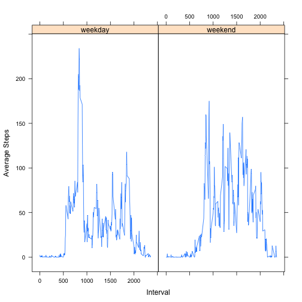

# Reproducible Research: Peer Assessment 1

## Loading and preprocessing the data

Prerequisites required to run this analysis: 
- The working directory is set to where you want to run the analysis
- The lattice and plyr packages are installed on your local system

We must assume that the user has set the proper working directory, so we begin by checking and loading the dependencies. 


```r
require("lattice")
require("plyr")
library(plyr)
library(lattice)
```


### 1. Load the data

First we check if the raw data has been downloaded an unzipped. If not, we do so. 


```r
if (!file.exists("activity.zip")) {
    download.file("http://d396qusza40orc.cloudfront.net/repdata%2Fdata%2Factivity.zip", 
        destfile = "activity.zip", method = "curl")
}

if (!file.exists("activity.csv")) {
    unzip("activity.zip")
}
```


The data is then read in to a data.frame. 

```r
df <- read.csv("activity.csv", stringsAsFactors = FALSE)
summary(df)
```

```
##      steps           date              interval   
##  Min.   :  0.0   Length:17568       Min.   :   0  
##  1st Qu.:  0.0   Class :character   1st Qu.: 589  
##  Median :  0.0   Mode  :character   Median :1178  
##  Mean   : 37.4                      Mean   :1178  
##  3rd Qu.: 12.0                      3rd Qu.:1766  
##  Max.   :806.0                      Max.   :2355  
##  NA's   :2304
```


### 2. Clean the data if necessary

We coerce the date column into the standard Date format. 


```r
df$date <- as.Date(df$date)
summary(df)
```

```
##      steps            date               interval   
##  Min.   :  0.0   Min.   :2012-10-01   Min.   :   0  
##  1st Qu.:  0.0   1st Qu.:2012-10-16   1st Qu.: 589  
##  Median :  0.0   Median :2012-10-31   Median :1178  
##  Mean   : 37.4   Mean   :2012-10-31   Mean   :1178  
##  3rd Qu.: 12.0   3rd Qu.:2012-11-15   3rd Qu.:1766  
##  Max.   :806.0   Max.   :2012-11-30   Max.   :2355  
##  NA's   :2304
```


## What is mean total number of steps taken per day?

### 1. Make a histogram of the total steps taken each day

We begin by creating new data frame containing the sum of steps for each day. 


```r
tdf <- ddply(df, ~date, summarise, totalsteps = sum(steps, na.rm = TRUE))
summary(tdf)
```

```
##       date              totalsteps   
##  Min.   :2012-10-01   Min.   :    0  
##  1st Qu.:2012-10-16   1st Qu.: 6778  
##  Median :2012-10-31   Median :10395  
##  Mean   :2012-10-31   Mean   : 9354  
##  3rd Qu.:2012-11-15   3rd Qu.:12811  
##  Max.   :2012-11-30   Max.   :21194
```


Then we simply plot a histogram of the total steps. We use breaks=10 for clarity. 


```r
hist(tdf$totalsteps, breaks = 10, main = "Histogram of Total Steps", xlab = "Total Steps", 
    ylab = "Frequency")
```

 


### 2. Calculate and report the mean and median

Using the data frame we created above this is very straightforward. 

```r
median(tdf$totalsteps)
```

```
## [1] 10395
```

```r
mean(tdf$totalsteps)
```

```
## [1] 9354
```


## What is the average daily activity pattern?

### 1. Make a time series plot of average steps taken vs. interval 

To plot this graph, we must summarise the mean steps accross each interval. This is a simple one-liner with plyr. 


```r
idf <- ddply(df, ~interval, summarise, meansteps = mean(steps, na.rm = TRUE))
summary(idf)
```

```
##     interval      meansteps     
##  Min.   :   0   Min.   :  0.00  
##  1st Qu.: 589   1st Qu.:  2.49  
##  Median :1178   Median : 34.11  
##  Mean   :1178   Mean   : 37.38  
##  3rd Qu.:1766   3rd Qu.: 52.83  
##  Max.   :2355   Max.   :206.17
```


Creating the plot is then straightforward. 

```r
plot(idf$interval, idf$meansteps, type = "l", main = "", xlab = "Interval", 
    ylab = "Average Steps")
```

 


### 2. Which 5-minute interval has the highest average number of steps? 

We simply find the maximum value in the meansteps column and print the interval. 


```r
maxMeanSteps <- idf[which.max(idf$meansteps), ]
maxMeanSteps$interval
```

```
## [1] 835
```


## Imputing missing values

### 1. Calculate and report the total number of missing values in the data set. 

We use the fact that TRUE is coerced to 1 as an integer and use the sum() function. 


```r
missingValues <- sum(is.na(df$steps))
missingValues
```

```
## [1] 2304
```


### 2. Strategy to fill in missing values

The strategy we use to impute missing values is to insert the mean for each 5 minute interval. To accomplish this, we must first calculate that mean for each interval over all days.  We then use plyr to apply that mean to each missing value. 


```r
impute.mean <- function(x) replace(x, is.na(x), mean(x, na.rm = TRUE))
dfimputed <- ddply(df, ~interval, transform, steps = impute.mean(steps))

# Sort the imputed data
dfimputed <- df[with(dfimputed, order(date, interval)), ]
```


### 3. Create a new data set with the missing values filled in

The dfimputed data set created above has the missing data filled in. 


```r
summary(dfimputed)
```

```
##      steps            date               interval   
##  Min.   :  0.0   Min.   :2012-10-01   Min.   :   0  
##  1st Qu.:  0.0   1st Qu.:2012-10-16   1st Qu.: 589  
##  Median :  0.0   Median :2012-10-31   Median :1178  
##  Mean   : 37.4   Mean   :2012-10-31   Mean   :1178  
##  3rd Qu.: 12.0   3rd Qu.:2012-11-15   3rd Qu.:1766  
##  Max.   :806.0   Max.   :2012-11-30   Max.   :2355  
##  NA's   :2304
```


### 4. Create a histogram and calculate the mean and median of the imputed data

We repeat the steps to plot a histogram and calculate mean and median on the imputed data set. 

First create a new data frame with the total steps for each day. 


```r
tdfimputed <- ddply(dfimputed, ~date, summarise, totalsteps = sum(steps, na.rm = TRUE))
summary(tdf)
```

```
##       date              totalsteps   
##  Min.   :2012-10-01   Min.   :    0  
##  1st Qu.:2012-10-16   1st Qu.: 6778  
##  Median :2012-10-31   Median :10395  
##  Mean   :2012-10-31   Mean   : 9354  
##  3rd Qu.:2012-11-15   3rd Qu.:12811  
##  Max.   :2012-11-30   Max.   :21194
```


Plot a histogram for the imputed totals


```r
hist(tdfimputed$totalsteps, breaks = 10, main = "Total Steps of Imputed Data", 
    xlab = "Total Steps", ylab = "Frequency")
```

 


Calculate the mean and median. 

```r
median(tdfimputed$totalsteps)
```

```
## [1] 10395
```

```r
mean(tdfimputed$totalsteps)
```

```
## [1] 9354
```


#### 4.1 Do the values differ from those above? 

We do not expect the mean and median to differ from those above. This is because we used the mean value of each interval to impute missing values in each interval. Since the mean is taken over the intervals, this should not have any effect. 

#### 4.2 What effect does imputing have?

We do not expect our imputing method to have any effect. We create a summary and plot to verify this. 

```r
idfimputed <- ddply(dfimputed, ~interval, summarise, meansteps = mean(steps, 
    na.rm = TRUE))
summary(idfimputed)
```

```
##     interval      meansteps     
##  Min.   :   0   Min.   :  0.00  
##  1st Qu.: 589   1st Qu.:  2.49  
##  Median :1178   Median : 34.11  
##  Mean   :1178   Mean   : 37.38  
##  3rd Qu.:1766   3rd Qu.: 52.83  
##  Max.   :2355   Max.   :206.17
```

```r
plot(idfimputed$interval, idfimputed$meansteps, type = "l", main = "Imputed Data", 
    xlab = "Interval", ylab = "Average Steps")
```

 


We do not detect any difference in the imputed data. 

## Are there differences in activity patterns between weekdays and weekends?

### 1. Create a new factor variable for weekends and weekdays

First create a boolean factor, them map the boolean values to "weekend" or "weekday". 

```r
df$daytype <- weekdays(df$date) %in% c("Saturday", "Sunday")
df$daytype <- mapvalues(df$daytype, from = c(TRUE, FALSE), to = c("weekend", 
    "weekday"))
head(df)
```

```
##   steps       date interval daytype
## 1    NA 2012-10-01        0 weekday
## 2    NA 2012-10-01        5 weekday
## 3    NA 2012-10-01       10 weekday
## 4    NA 2012-10-01       15 weekday
## 5    NA 2012-10-01       20 weekday
## 6    NA 2012-10-01       25 weekday
```


### 2. Make a plot for average steps per interval for weekends and weekdays

To create this plot, we must first calculate the mean steps for each time interval over weekends and weekdays separately.

We split the data into separate frames for weekends and weekdays and then assign the mean value to each interval using plyr. 


```r
dfweekdays <- df[df$daytype == "weekday", ]
idfweekdays <- ddply(dfweekdays, ~interval, summarise, meansteps = mean(steps, 
    na.rm = TRUE))
idfweekdays$daytype <- "weekday"

dfweekends <- df[df$daytype == "weekend", ]
idfweekends <- ddply(dfweekends, ~interval, summarise, meansteps = mean(steps, 
    na.rm = TRUE))
idfweekends$daytype <- "weekend"
```


We then bind the data frames back together. 


```r
# bind the two data frames back together
rdf <- rbind(idfweekends, idfweekdays)
summary(rdf)
```

```
##     interval      meansteps        daytype         
##  Min.   :   0   Min.   :  0.00   Length:576        
##  1st Qu.: 589   1st Qu.:  1.85   Class :character  
##  Median :1178   Median : 26.29   Mode  :character  
##  Mean   :1178   Mean   : 39.21                     
##  3rd Qu.:1766   3rd Qu.: 62.32                     
##  Max.   :2355   Max.   :234.10
```


We are now ready to plot. Creating multi-panel plots is simple using the lattice system, so we use the xyplot() function. 


```r
xyplot(meansteps ~ interval | daytype, data = rdf, type = "l", main = "", xlab = "Interval", 
    ylab = "Average Steps")
```

 


We see that there is in fact a difference in behaviour between weekdays and weekends.

It appears that on weekdays, people are more active in the mornings and sedentary for the day. Activity is more consisten throughout the day on weekends. This is consistent with people travelling to work in the morning and sitting throughout the day on weekdays, and being more active on the weekends. 
